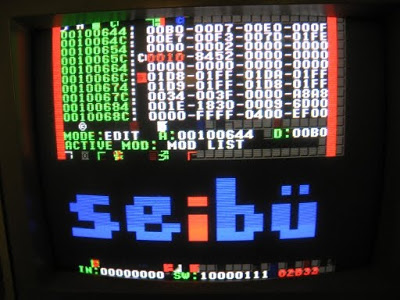

# 68k-Seibu
Seibu coin-op hw analysis tool (Motorola 68000 Assembler)
 ## Technical information
*Runs on custom arcade hardware (Motorola 68000 + custom coprocessors) designed by Rise Corporation (株式会社ライズ), dev department of Seibu Kaihatsu Inc. (有限会社 セイブ開発) around 1990-1991 and abandoned a couple of years later.
*Modular construction (two modules : memory viewer/editor and custom coprocessor macro uploader are included).
*Use AS Macro assembler (http://john.ccac.rwth-aachen.de:8000/as/) to build binary file.
*Controls: DSW1 bits 0,1,2  P1 inputs ( UP/DOWN/LEFT/RIGHT/BUTTON1), P1 Start
 ## Screenshot

 ## Authors
 * **Tomasz Słanina** - [dox](https://github.com/tslanina)
 ## License
 This project is licensed under the GPL v3 License - see the [LICENSE.md](LICENSE.md) file for details
